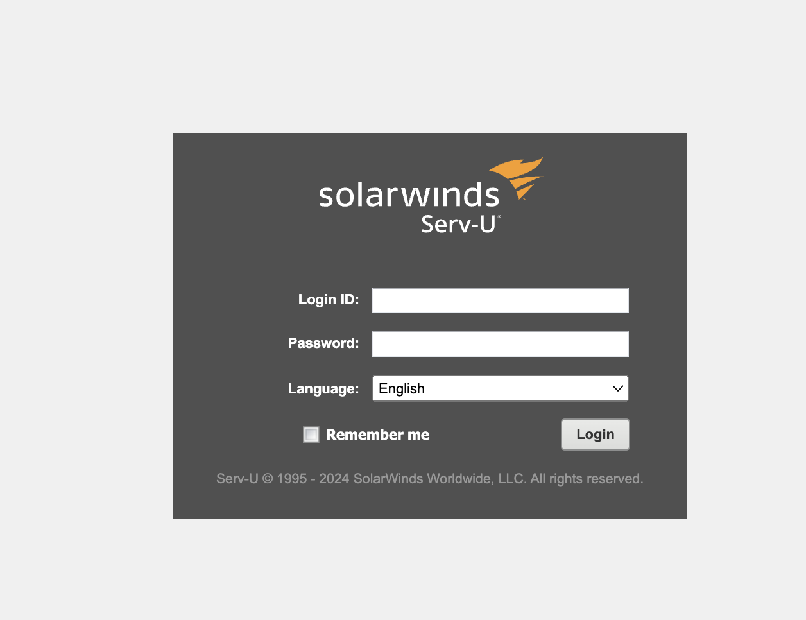

# Exercise 1: Botnets

## How does the botnet work?
The Mirai botnet can be broken into steps:
1. Scan the Internet for devices
2. Brute-force devices on passwords (62 user-password pairs)
3. Infected devices call home (send device specs to Reporting Server)
4. Bot-master talks to RS via the Command & Control server (through TOR)
5. Bot-master decides which bots will be infected
6. Bot-master sends malware code trough `wget` and patching the system - updating the username-password pair
7. Bot-master finds a target for attack (IP + duration)
8. Bots attack target with one of the 10 available attack variations using Generic Routing Encapsulation (GRE), `TCP` and `HTTP` flooding attacks

> Mirai botnet is known for 2 main attack vectors: bruteforce attempts and exploitation of IoT vulnerabilities. Preferred method for expanding - scanning the Internet for open telnet/SSH servers on known ports. Vulnerability exploitation on `V3GA` variant targets Linux environments and embedded devices (Linux embedded)

## What does the botnet do to infect a device?
`MIRAI` uses two methods of infection:

Direct Connection: If a vulnerable device is directly connected to the internet (online), it can connect back to the bot master's IP address and port number selected.

The bots themselves scan the internet for next devices to infect or can be targeted to a specific Internet location. 
* A `worm` just spreads without a Command and Control node (controlled by bot-master).

## Use GreyNoise to find devices matching the attack patterns from V3G4. You can filter the results by CVEs and other tags (e.g.,“iot tags:Mirai”). --> See attacker details

## • Use Shodan to find out more about the list of IPs you gathered.

## Which devices did you find? Can you see any common attributes (e.g. open ports, operative system, manufacturer, etc)?
IP addresses: 
83.175.158.17
63.47.114.190
92.54.57.90 - CVE for backdoor attempt, telnet bruteforcer, MIRAI, Generic IoT brute forcer

All have `telnet` port 23 open for brute-force and spreading
Super old operating systems like Linux 2.4 (2001) - current version is Linux 6.8 (2024)
Manufacturer (vendor) - often encountered MicroTik, LinkSys - routers & network devices

What can we do to harden the security of your IoT devices? how can we
prevent our devices from joining a Mirai botnet?

##  What can we do to harden the security of your IoT devices? How can we prevent our devices from joining a Mirai botnet?

* Change Default Credentials: Many IoT devices come with default usernames and passwords which are often used by botnets for unauthorized access. Changing these to strong, unique credentials can significantly reduce the risk.

* Regular Updates: Keep the device firmware and software up-to-date. Manufacturers often release updates that fix known vulnerabilities.

* Firewall and Network Security: Use a firewall to block incoming connections from the internet to IoT devices when possible. Also, segregate IoT devices on their own network separate from critical information systems.

* Disable Unnecessary Services: If an IoT device has services (like Telnet, SSH, or web servers) that are not needed for its operation, disable them to reduce potential attack vectors.

* Intrusion Detection Systems (IDS): Use IDS to monitor network traffic for signs of a botnet or other attack.

* Rate limiting: Implement rate limiting on your network to prevent DDoS attacks which are often carried out by botnets like Mirai.

# Exercise 2: Exposed IoT Devices

## First, find out which addresses DTU exposes to the Internet. You can use WHOIS services, DNS records, or even Shodan to find information about a domain. Hint: try “dtu.dk”

* Find ISP and ASN responsible for DTU domains with Shodan - Danish network for Research & Education, ASN is AS1835 - 739 exposed addresses from DTU

* 

 
Many many vulnerabilities on DTU food devices

## Exposed Banner Information

Now, query Shodan or Censys to see which services they expose and their banner information. A banner is the first response a service returns when a client tries to connect to it. You do not need to do this part yourself, you can use Shodan or another meta-scanner to retrieve this information. Focus on IoT protocols, such as the ones botnets target the most (e.g., SSH, MQTT, Telnet, FTP, MySQL...)

* Open ports are usually 80 `HTTP` , 443 `HTTPS`, 22 `SSH`, 21 `FTP`, 3389 `RDP`, 25 `SMTP`, 53 `DNS`, `MQTT`

## Banners Grabbing

Banners contain many interesting details about the exposed service (e.g. encryption mechanisms, authentication policies, service version, or even 2 OS and other device-specific information). Sometimes, it is sufficient to say that we can retrieve their banner in order to say they leak sensitive information. Why do you think this is the case?

* From the banners you see, which information could be used to gain additional insights into the device’s security?

    Using such tools one can observe the vulnerabilities of specific target - one can attempt to perform such vulnerabilities against the target's services and open ports (old and unpatched Apache and OpenSSL versions )

* Is any of these services leaking sensitive information?

    No longer supported versions `OpenSSL/1.1.1k`, `Apache/2.4.37 (rocky)`

    
    

* Could an attacker use the information from these banners to gain an initial foothold into the network?

    Could attempt to attack the target device with one of the vulnerabilities detected according to service and open ports. Hence, be able to exploit system and gain access

* How would you mitigate these threats?

    1. Restrict access to services on the network
    2. Shut down unused or unnecessary services running on network hosts
    3. You can override your server’s default banner behavior to hide version information. System administrators can customize default banners, configure the network host’s application or operating system to disable the banners, or remove information from the banners that could give an attacker a leg up.
    4. Keep your server and systems up to date to secure your applications against known server exploits - Patched Software and OS
    5. Customize the banners to display a warning message to potential hackers - shows system is being monitored to defer further attacks

    **Bonus**: Clients should use VPN connections to access servers on DTU whenever possible

> Optional HackerLab - Attempt to perform NoSQL injection to the PHP login page(form):

`curl -X POST -d 'username=admin&password[$ne]=foo' https://hackerlab.dtu.dk/chall/login.php`

> Script for queries with various ReGeX starts until password is cracked character by character:
    
`curl -X POST -d 'username=admin&password[$re]=${crackPass}${nextChar}' https://hackerlab.dtu.dk/chall/login.php` for every char in a **CHARSET**