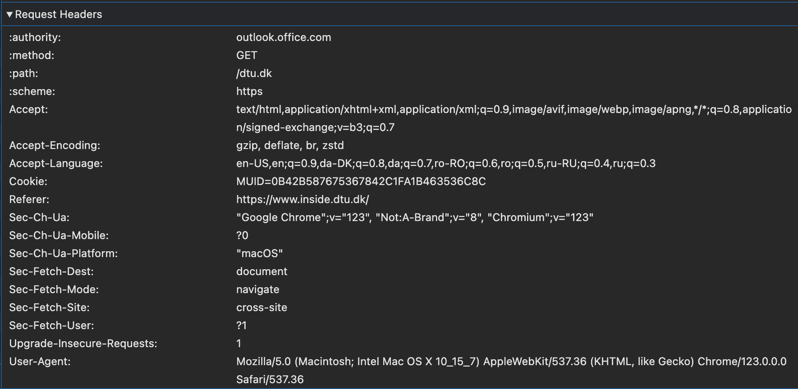

# Exercise 1 - WebServer Learnings about Client

## Identify what HTTP headers are part of your web browser’s usual HTTP request:

The HTTP request headers depend on the website the request is sent to, based on the site's configuration.

## Check how many trackers they have and what they belong to:

On `dtu.dk` obtained 2 trackers:
* Adobe Typekit
* Google Tag Manager

On `dr.dk` obtained 3 trackers:
* Cookiebot (by Cybot)
* Site Analytics (by Segment)
* Dr.dk (internal pop-up)

# Exercise 2 - Hiding Data in Plain Sight

In this exercise, we will learn how to secretly communicate data without using cryptography! For this, we rely on an ancient technique called steganography.

Compare the files dtu-logo.jpg and embedded.jpg visually. Do you see differences? - No differences visually 

Then try to extract the secret message from embedded.jpg using steghide, using the passphrase ”netsec” - also called **stego-key** or **marking-key**.

Command to extract hidden message in embedded image:

`steghide extract -sf <stegofile=./embedded.jpg> -p "netsec" -xf=<extractfile=secret.txt>` 

* `extract, --extract` Extract secret data from a stego file.
* `-sf, --stegofile` filename - Specify the name for the stego file that will be created. If this argument is omitted when
calling steghide with the embed command, then the modifications to embed the secret data
will be made directly to the cover file without saving it under a new name.
* `-xf, --extractfile` filename - Create a file with the name filename and write the data that is embedded in the stego file to
it. This option overrides the filename that is embedded int the stego file. If this argument is
omitted, the embedded data will be saved to the current directory under its original name.

Extraction result is output in the `text.txt` file (message: **HELLO STUDENTS! I AM A TEXT THAT WAS HIDING IN A JPG**)

# Exercise 3 - Secretly Getting Data Out

Assume you are a journalist and your friend Alice works for EvilCorp Inc. She desparately wants to give you information about their recent evil deeds, but unfortunately she cannot move data out of EvilCorp physically as USB ports are locked down etc.

* Given the techniques you have learned so far in the course, in particular those in this lecture, devise a strategy for Alice to send the documents to you digitally.
    1. Alice could hide the secret content using stenography with a passphrase known to both of them and then send it by encrypted e-mails (`PGP Encryption`).

    2. Alice could communicate via Onion Routing (TOR) to send the information. This could achieve anonymity and safety for the whistle-blower.

    Alice could use various techniques to transfer the files outside of the internal network perimeter such as:
    • Cloud storage where access is shared with the journalist,
    • email communication (with PGP encryption),
    • E2E encrypted messaging chat.
    Alice could also zip the files, protect them with a password and send them over via email. Then, she would send the respective password via a different channel.

* Assume that EvilCorp also disallows the use of e-mail encryption and scans all e-mails or files getting out of their company networks for company secrets. They also seem to be able to check if steganography was applied to files. Develop a strategy for how Alice could hide information in the HTTP headers when accessing a website
    
    *  The secret content could be embedded in the HTTP request headers to a specific website. The message will be encoded and placed in the `ETag` header or the `If-None-Match` header of a request - headers that can be easily modified. Alternatively, stenography can be included in the `Cookie` header as encoded text or ciphertext assuming the 2 parties share the required encryption keys (symmetric or public-private).

    * `Approach 1`: Use the packet fragmentation and send chunks of messages through HTTP headers. The file could be first encoded with a suitable encoding mechanism such as base64. Alice could chose to create custom headers or use steganography techniques to organize headers in a certain manner, agreed upon with the journalist.

    * `Approach 2`: Create a fake cookie and encode the file as cookie data.

    By using the approach 1, the Intrusion Prevention System could potentially recognize nonstandard HTTP headers, raise alarms and block the requests. However, with approach 2, IPS usually would not check the content of the cookie.

# Exercise 4 - Using TOR - Onion Routing 
Do you notice any difference in response behavior for sites you know? Try to download a file of reasonable size and look at download speeds.

- The response behavior becomes significantly slower - higher latency as a result of the Onion Routing protocol being used. The message is sent through a `circuit` of 3 onion routers (nodes) and being encrypted multiple times, hence increasing the transmission delay in order to provide `anonymity`. Noticeably slower due to the additional routing steps and the overhead of
encrypting and decrypting traffic

You likely googled for the Tor Browser, opened the first result, then downloaded and executed the file. What kind of attacks could a malicious actor which controls the network have done so that you don’t download the correct executable?

- The attacker can spoof the DNS response and present a different malicious site that looks like a clone of the real one. The file downloaded from the fake website can include a malicious executable that is implicitly trusted by the user and the system.

- `Alternative`: Attacker controlling the network could potentially use the following attacks: 
    * `a.` Man-in-the-middle (MITM) attack: An attacker could intercept the network traffic between the user and the download server, and replace or modify the downloaded executable file in transit, adding malware or other malicious code to the file.
    * `b.` DNS Spoofing: An attacker could spoof the DNS response for the download server, directing the user to a malicious server that serves a fake executable file containing malware.
    * `c.` Website spoofing: An attacker could create a fake website that looks exactly like the legitimate site and eventually trick the user into downloading and executing a malicious file.

The Tor project allows you to verify that the downloaded file is indeed correct. Follow the instructions on https://support.torproject.org/tbb/how-to-verify-signature/. Which assumptions does their verification procedure make and how could it be undermined?

- The assumption relies on the fact that the Developer key found by the `gpg` query is legitimate and not tampered with

- The user has downloaded a legitimate `GPG` 

- The website that the user is reading the instructions from is legitimate and not spoofed (the mentioned signing key could be replaced, along with the link). The user must make sure that the website is official by verifying the SSL certificate.
